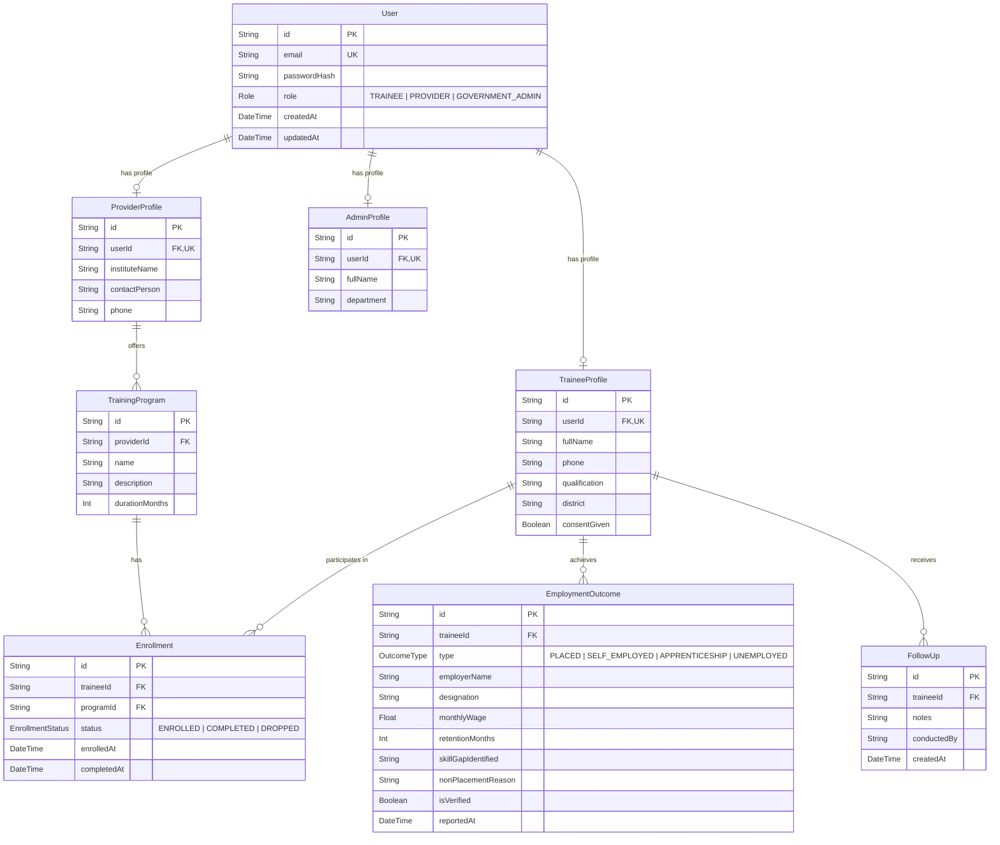

# Entity Relationship Diagram (ERD)

This diagram represents the PostgreSQL schema models and relations defined in `prisma/schema.prisma`.

```mermaid
erDiagram
    User ||--o| TraineeProfile : "has profile"
    User ||--o| ProviderProfile : "has profile"
    User ||--o| AdminProfile : "has profile"

    ProviderProfile ||--o{ TrainingProgram : "offers"
    TrainingProgram ||--o{ Enrollment : "has"
    TraineeProfile ||--o{ Enrollment : "participates in"
    TraineeProfile ||--o{ EmploymentOutcome : "achieves"
    TraineeProfile ||--o{ FollowUp : "receives"

    User {
        String id PK
        String email UK
        String passwordHash
        Role role "TRAINEE | PROVIDER | GOVERNMENT_ADMIN"
        DateTime createdAt
        DateTime updatedAt
    }

    TraineeProfile {
        String id PK
        String userId FK,UK
        String fullName
        String phone
        String qualification
        String district
        Boolean consentGiven
    }

    ProviderProfile {
        String id PK
        String userId FK,UK
        String instituteName
        String contactPerson
        String phone
    }

    AdminProfile {
        String id PK
        String userId FK,UK
        String fullName
        String department
    }

    TrainingProgram {
        String id PK
        String providerId FK
        String name
        String description
        Int durationMonths
    }

    Enrollment {
        String id PK
        String traineeId FK
        String programId FK
        EnrollmentStatus status "ENROLLED | COMPLETED | DROPPED"
        DateTime enrolledAt
        DateTime completedAt
    }

    EmploymentOutcome {
        String id PK
        String traineeId FK
        OutcomeType type "PLACED | SELF_EMPLOYED | APPRENTICESHIP | UNEMPLOYED"
        String employerName
        String designation
        Float monthlyWage
        Int retentionMonths
        String skillGapIdentified
        String nonPlacementReason
        Boolean isVerified
        DateTime reportedAt
    }

    FollowUp {
        String id PK
        String traineeId FK
        String notes
        String conductedBy
        DateTime createdAt
    }
```
